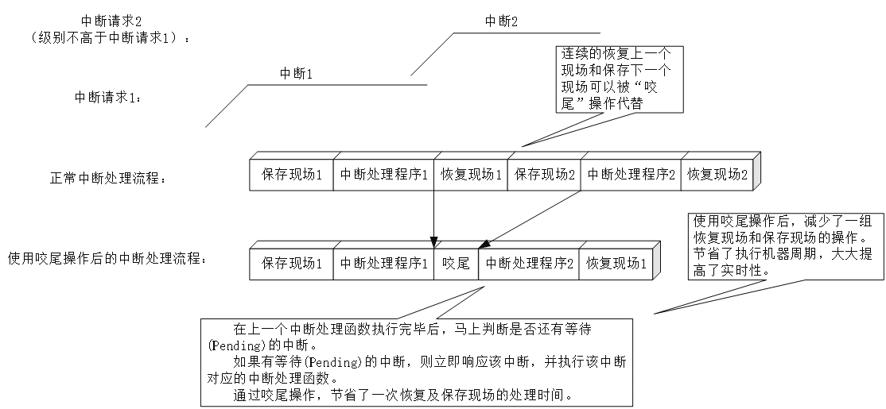

## **5.12. 中断咬尾**

处理器内核正在处理某个中断的过程中，可能有新中断请求到来，但是“新中断的级别”低于或者等于“当前正在处理的中断级别”，因此，新中断不能够打断当前正在处理的中断（因此不会形成嵌套）。

当处理器完成当前中断之后，理论上需要恢复上下文，然后退出中断回到主应用程序，然后重新响应新的中断，响应新的中断又需要再次保存上下文。因此，存在着一次背靠背的“恢复上下文”和“保存上下文”操作，如果将此背靠背的“恢复上下文”和“保存上下文”省略掉，则称之为“中断咬尾”，如图 5-8中所示，显而易见，中断咬尾可以加快多个中断的背靠背处理速度。

​                                                                 **
图 5-8 中断咬尾示意图
**

在Bumblebee内核中，只有非向量处理模式才支持中断咬尾，请参见第5.13.1.3节了解更多详细介绍。

